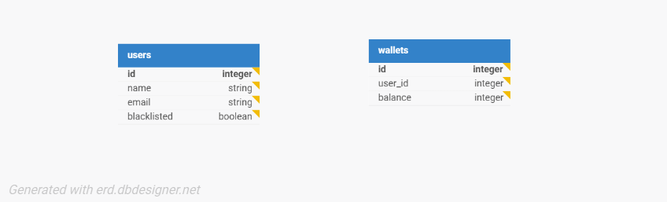

# Lendsqr Wallet API (Assessment)

A Node.js API built with TypeScript, Express, and KnexJS with a MySQL database.  
The API allows:
- User registration (with Karma blacklist check via Lendsqr Adjutor API)
- Wallet funding
- Wallet transfers
- Wallet withdrawals

This project was built as part of the Lendsqr backend engineering assessment

---

##  Tech Stack
- **Node.js LTS**
- **Express**
- **TypeScript**
- **KnexJS**
- **MySQL**
- **Jest**
- **Dotenv**

---

## 📂 Project Structure
lendsqr-wallet/
├── controllers/
│ └── userController.ts
│ └── walletController.ts
├── routes/ 
│ └── userRoutes.ts
│ └── walletRoutes.ts
├── services/ # External integrations (Karma API)
│ └── karmaService.ts
├── middleware/ # Faux authentication middleware
│ └── auth.ts
├── config/ 
│ └── db.ts
├── tests/ # Jest test cases
│ └── user.test.ts
│ └── wallet.test.ts
├── index.ts 
├── knexfile.ts 
└── README.md

---

## 🗄️ Database Design

### Entities
- **Users**
  - id (PK)
  - name
  - email (unique)
  - blacklisted (boolean)
  - created_at
- **Wallets**
  - id (PK)
  - user_id (FK → Users)
  - balance (decimal)
  - created_at
- **Transactions**
  - id (PK)
  - from_user_id (nullable, FK → Users)
  - to_user_id (nullable, FK → Users)
  - type (`fund`, `transfer`, `withdraw`)
  - amount
  - created_at

### ER Diagram

## 🔑 Authentication
- Faux token authentication using middleware.

## Setup Instructions

git clone https://github.com/Michvista/lendsqr-wallet.git

cd lendsqr-wallet

# Install dependencies
npm install

# Run migrations
npx knex migrate:latest

# Start dev server
npm run dev

